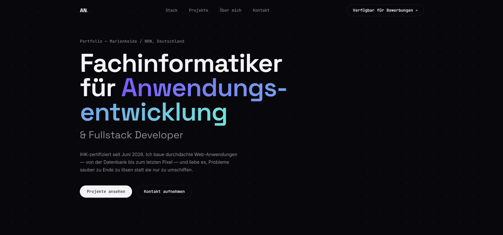

# Mein Portfolio

Personal one-page portfolio website — built from scratch with pure HTML5, CSS3 and vanilla JavaScript (no frameworks). Dark-mode, Awwwards/Godly-inspired design with an interactive canvas grid, hover-glow project cards, and a scroll-driven timeline.

## Live Demo

🔗 [View live](https://vampirenoob.github.io/Mein-Portfolio/)



## Features

- Interactive hero background (canvas dot-grid reacting to mouse movement)
- Bento-style tech stack grid (Frontend / Backend / Design & Tools)
- Project cards with live-demo/GitHub links and a per-project accent-color hover effect
- Scroll-filled vertical timeline for education & career history
- Contact section with direct links (GitHub, LinkedIn, Xing, Instagram)
- Impressum & Datenschutzerklärung as in-page modals (GDPR/TMG-compliant, one-page structure preserved)

## Tech Stack

- HTML5
- CSS3 (no framework — hand-written, custom properties for theming)
- Vanilla JavaScript (Canvas API, IntersectionObserver)

## Structure

```
├── pictures/
│   ├── online-resume.ico
│   └── portfolio.png
├── index.html
├── style.css
├── script.js
├── README.md
└── .gitignore
```

## Contact

Feel free to reach out via GitHub or Instagram:
- GitHub: [@VampireNoob](https://github.com/VampireNoob)
- Instagram: [@vampirenoob](https://www.instagram.com/vampirenoob/)